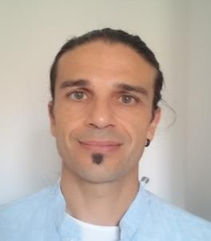

<h2>

</h2>
# Raúl García Lepe
Formador Full-Stack Development

<a href="http://bcncodes.academy">bcncodes.academy@gmail.com</a>

## OBJETIVO PROFESIONAL

Preparar e impartir formación de calidad actualizada en el ámbito de la programación de aplicaciones y la gestión y administración de distintos sistemas de bases de datos.

### Especialidades

JavaScript, CSS & HTML; ANGULAR, REACT, NodeJS & ExpressJS; MongoDB, GIT, Técnicas Agile, TDD, RDBMS

### Competencias

__Aprendizaje__ y __transmisión de conocimientos__. Nuevos lenguajes de programación y programa informáticos

__Pensamiento analítico__ y __científico__ a la hora de analizar problemas y requerimientos informáticos.

__Comunicación__. Interpretación de contenidos y transmisión oral y escrita.

__Planificación__ y __Organización__. Estructuración de contenidos y planificación de itinerarios formativos

__Trabajo en equipo__. Uno de los pilares del desarrollo de proyectos informáticos que también ofrece resultados a la hora de la formación. 

__Orientación al alumno__ y __flexibilidad__. Recogiendo las sugerencias y adaptando el itinerario formativo para satisfacer sus necesidades

__Iniciativa__ para buscar e implantar soluciones a los problemas planteados.

## Experiencia Formativa

`2020`
__NASCOR Formación__. Certificado Profesional de Desarrollo Web (IFCD0210). Módulo Desarrollo Web Lado Cliente (125h).

`2019`
__CIFO La Violeta__. Itinerario Formativo Mean-Stack. Desarrollo Web con Angular, MongoDB y NodeJs (500h).

__IronHack__. Módulo de desarrollo web del curso MERN-STACK (160h)

`2018`
__CIFO La Violeta__. Itinerario Formativo Mean-Stack. Desarrollo Web con Angular, MongoDB y NodeJs (300h).

__CIFO L'HOSPITALET__. Certificado Profesional de Desarrollo Web (IFCD0210)(490h).

__NETMIND__. Certificado Profesional de Desarrollo Web (IFCD0210)(190h).

__MONLAU COMPETICIÓN__. Curso INFORMÁTICA APLICADA, curso 2017-2018(60h).

`2017`
__Mútua General de Catalunya__. Fundamentos de PL/SQL y Optimización SQL para programadores (45h).

__Fundación CIM (UPC)__. Certificado Profesional Gestión y Administración de Bases de Datos y
Programación (IFCT0310) (520h)

## Otra Experiencia Laboral 

`2019`- `Actualidad`
__ESTUDIOS DWWWI__: Consultoría Desarrollo WebAPPS con Angular y IONIC.  

`2017`
__INNOBUS 2017__: Proyecto de Innovación organizado por el Innobaix de Cornellà de
- Preparación y presentación de distintos retos de Innovación a ALMIRALL, BAYER, AVANT-BUS, Puerto de Barcelona.

`2001-2015`  
__INDRA SISTEMAS__: Multinacional dedicada al desarrollo y mantenimiento de sistemas
informáticos.
- Jefe de proyecto, Analista y Formador
  - Gestión de Equipos de desarrollo.
  - Interlocución con clientes.
  - Documentación de requerimientos.
  - Análisis e implantación de sistemas de información.
  - Formación de usuarios y miembros de equipos.
      - Preparación de temario y formación in-company en Business Objects para INDRA.
      - Formación en aplicaciones de gestión de expedientes a distintos clientes.
      - Formación en bases de datos multidimensionales Hyperion Essbase en Gas Natural.

`1996-1999`
__Instituto Nacional de Investigaciones Agrarias__: Instituto especializado en I+D del Ministerio de Agricultura.
Investigador predoctoral
  - Doctorado en control de plagas en plantas.

## Formación Académica

`1994`
 __Licenciatura__ en Ciencias Biológicas por la Universidad Autónoma de Madrid (UAM).

`1995`
 __Certificado de Adaptación Pedagógica__ (CAP) por la Universidad Complutense de Madrid

`1996`
 __Grado__ de Licenciatura  por la Facultad de Ciencias (UAM)

`1996`
 Concesión del __Premio Extraordinario de Licenciatura__ Facultad de Ciencias (UAM)

### Certificaciones

ACTIC (Nivell 2)

Certificado de Técnico de Gestión Ambiental.

## Formación Técnica Informática

`2017` 
PROGRAMACIÓ CONTINGUTS WEBS AMB WORDPRESS I JOOMLA. Cibernàrium (BCN).

`2016` 
SCRUM: INTRODUCCIÓ AL DESENVOLUPAMENT ÀGIL DE SOFTWARE. Cibernàrium (BCN). 12hs.

`2015` 
MOODLE: DISSENYA I ADMINISTRA UNA PLATAFORMA DE FORMACIÓ ON LINE. Cibernàrium (BCN).8h

`2005` 
ARQUITECTURA Y DISEÑO DE APLICACIONES J2EE. SISNET (BCN). 32 hs.

`2005` 
PROGRAMACIÓN XML ONLINE EDUCATERRA S.L.. (BCN). 40 hs.

`2004` 
ANÁLISIS Y DISEÑO ORIENTADO A OBJETOS - UML- BIT. (BCN). 32 hs.

`2001` 
IPLANET. BIT FORMACION INFORMATICA. (BCN). 32 hs.

`2001` 
JAVA. BIT. (BCN). 64 hs

`1999` 
BUSINESS INTELIGENCE. EUROPSTAT (París) 120 hs.

`1999` 
DESIGNER, SQL Y ADMINISTRACIÓN DE BASES DE DATOS ORACLE. COMUNIDAD DE MADRID. 180 hs.

<!-- A list is also available [online](http://scholar.google.co.uk/citations?user=LTOTl0YAAAAJ) -->

## Idiomas

__CASTELLANO__, lengua nativa

__CATALÁN__ NIVEL C (Certificado)

__INGLÉS__ NIVEL ALTO (5º EOI y estancia como Investigador invitado en el Department of Agricultural Sciences, University of Bristol, Long Ashton, Reino Unido. 1998)

__FRANCÉS__ NIVEL ELEMENTAL

### Última actualización

Febrero 2020

